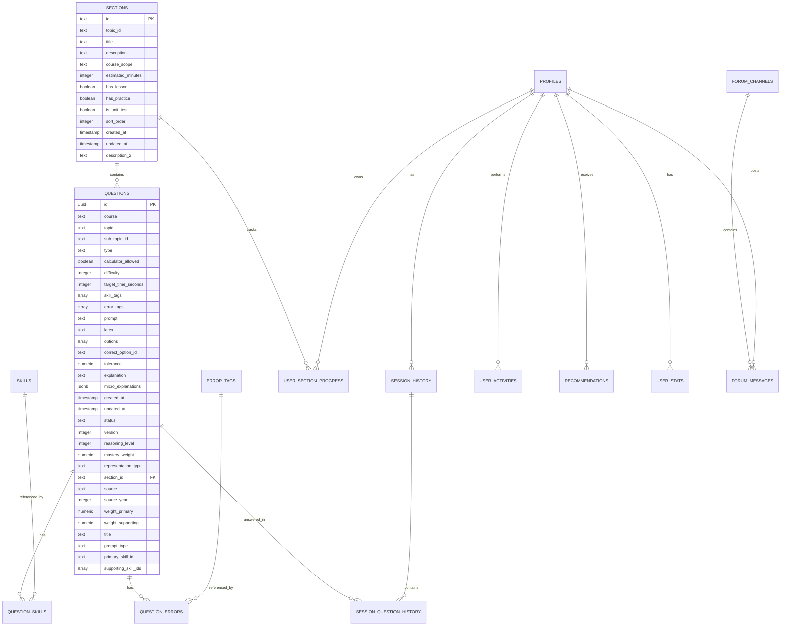

# Supabase Database Architecture

## 数据库总览

**导出时间**: 2026-02-06  
**数据库URL**: `https://xzpjlnkirboevkjzitcx.supabase.co`  
**Schema**: `public`

### 统计信息

| 指标 | 数量 |
|------|------|
| 总表数 | 10+ |
| 有数据的表 | 2 (sections, questions) |
| 总数据行数 | 877 rows |
| Migrations | 207 |

---

## 实体关系图 (ER Diagram)



---

## 核心表详解

### 1. `sections` (122 rows)

**用途**: 课程章节和单元测试的组织结构

**主要字段**:
- `id`: 章节唯一标识 (如 "Both_Limits_unit_test")
- `topic_id`: 所属主题ID
- `title`: 章节标题
- `description` / `description_2`: 章节描述
- `has_lesson`: 是否包含课程
- `has_practice`: 是否包含练习
- `is_unit_test`: 是否为单元测试

**数据示例**:
```json
{
  "id": "Both_Limits_unit_test",
  "topic_id": "Both_Limits",
  "title": "Unit 1 Test",
  "course_scope": "both",
  "has_lesson": true,
  "has_practice": true,
  "is_unit_test": true
}
```

---

### 2. `questions` (755 rows)

**用途**: 所有练习题和测试题的存储

**主要字段**:
- `id`: 问题UUID
- `section_id`: 所属章节 (FK → sections.id)
- `type`: 题型 (MCQ, FRQ等)
- `difficulty`: 难度 (1-10)
- `prompt`: 问题文本
- `options`: 选项数组
- `correct_option_id`: 正确答案
- `explanation`: 解释
- `skill_tags`: 技能标签数组
- `error_tags`: 错误类型标签数组

**数据示例**:
```json
{
  "id": "c351da6f-a1c7-4cc5-aa9f-efed76b3930b",
  "section_id": "1.14",
  "type": "MCQ",
  "difficulty": 5,
  "prompt": "Which statement correctly interprets...",
  "skill_tags": ["infinite_limits_asymptotes", "limit_notation"],
  "error_tags": ["notation_misread"],
  "status": "published"
}
```

---

## 数据表分类

### 📚 Core Content (核心内容)
- **`sections`** (122 rows) - 课程章节结构
- **`questions`** (755 rows) - 题库

### 🏷️ Metadata (元数据)
- **`skills`** (empty) - 技能定义
- **`error_tags`** (empty) - 错误类型定义
- **`question_skills`** (empty) - 问题-技能关联表
- **`question_errors`** (未检测到) - 问题-错误关联表

### 👤 User & Progress (用户和进度)
- **`profiles`** (未检测到) - 用户资料
- **`user_section_progress`** (empty) - 用户章节进度
- **`user_stats`** (empty) - 用户统计
- **`session_history`** (未检测到) - 会话历史
- **`session_question_history`** (未检测到) - 问题回答历史
- **`user_activities`** (未检测到) - 用户活动日志

### 🎯 Recommendations (推荐系统)
- **`recommendations`** (empty) - 题目推荐

### 💬 Forum (论坛社交)
- **`forum_channels`** (empty) - 论坛频道
- **`forum_messages`** (empty) - 论坛消息
- **`forum_members`** (未检测到) - 频道成员
- **`direct_messages`** (未检测到) - 私信

---

## 关键关系

### 1. Sections → Questions
- **关系**: 一对多
- **外键**: `questions.section_id` → `sections.id`
- **说明**: 每个章节包含多个问题

### 2. Questions → Skills/Errors
- **关系**: 多对多 (通过标签数组)
- **字段**: `questions.skill_tags[]`, `questions.error_tags[]`
- **说明**: 每个问题关联多个技能和错误类型

### 3. Users → Progress
- **关系**: 一对多
- **说明**: 用户可以有多个章节进度记录

---

## 数据访问模式

### 前端主要查询

根据 `AppContext.tsx` 分析的主要查询：

```typescript
// 1. 获取论坛频道
supabase.from('forum_channels').select('*')

// 2. 获取论坛消息
supabase.from('forum_messages').select('*')

// 3. 获取用户进度
supabase.from('user_section_progress').select('*')

// 4. 获取问题尝试记录
supabase.from('question_attempts').select('*')

// 5. 获取用户资料
supabase.from('user_profiles').select('*')
```

---

## RPC Functions

数据库中定义的存储过程/函数需要通过SQL编辑器单独查看。

常见的RPC可能包括：
- 获取用户统计数据
- 计算进度百分比
- 推荐题目算法
- 雷达图数据生成

---

## 索引和性能

### 推荐索引

基于查询模式，建议的索引：

```sql
-- Questions表
CREATE INDEX idx_questions_section_id ON questions(section_id);
CREATE INDEX idx_questions_status ON questions(status);
CREATE INDEX idx_questions_difficulty ON questions(difficulty);

-- User Progress表
CREATE INDEX idx_user_section_progress_user_id ON user_section_progress(user_id);
CREATE INDEX idx_user_section_progress_section_id ON user_section_progress(section_id);

-- Forum表
CREATE INDEX idx_forum_messages_channel_id ON forum_messages(channel_id);
CREATE INDEX idx_forum_messages_created_at ON forum_messages(created_at DESC);
```

---

## 数据流总结

```
用户登录 
  → 加载 sections (课程结构)
  → 查询 user_section_progress (用户进度)
  → 显示dashboard

用户做题
  → 获取 questions (题目)
  → 记录 session_question_history (答题记录)
  → 更新 user_section_progress (进度)
  → 生成 recommendations (推荐)

用户访问论坛
  → 获取 forum_channels (频道列表)
  → 获取 forum_messages (消息)
  → 发送消息 (新增记录)
```

---

## 文件位置

- **完整Schema JSON**: `database/schema/complete-schema.json`
- **Schema参考文档**: `database/schema/complete-schema-reference.md`
- **Migrations**: `database/migrations/` (207个文件)
- **Seeds**: `database/seeds/units/` (按单元组织)
